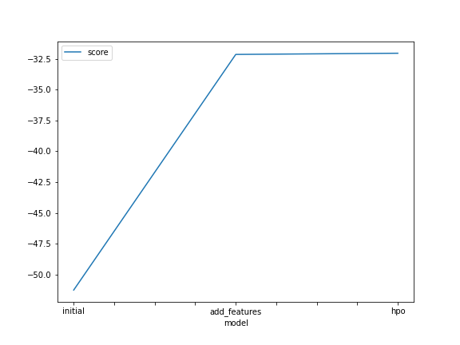
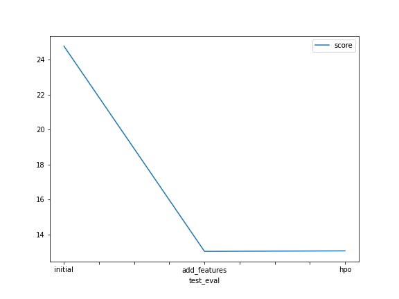

# Report: Predict Bike Sharing Demand with AutoGluon Solution
Udacity AWS-MLE Nanodegree Project 1 submission - Bike Sharing Demand Prediction Competition on Kaggle using autogluon solution.
#### Mariam Garuba

## Initial Training
### What did you realize when you tried to submit your predictions? What changes were needed to the output of the predictor to submit your results?
The predictor changes as more parameters were added to the **.fit()** method and score values dropped upon each application.

### What was the top ranked model that performed?
The top ranked model is WeightedEnsemble_L3 with a score_val of -32.147570 and pred_time_val of 20.492811.

## Exploratory data analysis and feature creation
### What did the exploratory analysis find and how did you add additional features?
New features were obtained from the datetime column 

### How much better did your model preform after adding additional features and why do you think that is?
The model didn't perform better with additional features because these added  features were not so meaningful in improving model performance.

## Hyper parameter tuning
### How much better did your model preform after trying different hyper parameters?
The model performed much better after trying different hyper parameters. However, determining the right combinations for hyperparameters tuning whose values control the learning process and determine the values of model parameters is crucial.

### If you were given more time with this dataset, where do you think you would spend more time?
With a large dataset, more time could be spend on feature engineering as it's a time-consuming process. So, understanding features can ease the complex process of feature engineering. 

### Create a table with the models you ran, the hyperparameters modified, and the kaggle score.
|model|hpo1|hpo2|hpo3|score|
|--|--|--|--|--|
|initial|24.784595|13.024950|13.053311|1.79429|
|add_features|42.268417|5.231890|6.938899|0.49194|
|hpo|47.059227|4.275373|6.545098|0.48773|

### Create a line plot showing the top model score for the three (or more) training runs during the project.

### Create a line plot showing the top kaggle score for the three (or more) prediction submissions during the project.

## Summary
The project showed the relevance of both feature engineering and hyper parameter optimization to machine learning workflows.
